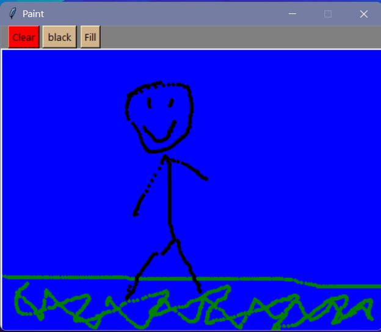

# Old Style Paint App

## Screenshot

## Description:
Old School vibes. This is a simple paint program made with Python and Tkinter, now packed as a .exe so you can just run it. Draw, fill, pick colors, or clear the canvas—just like the OG Paint.

## Features:

Draw Mode: Click or drag to draw with the current color.

Fill Mode: Fill the entire canvas with your selected color. Toggle between draw/fill mode easily.

Color Picker: Cycle through a set of colors for maximum painting swag.

Clear Canvas: Clear everything and start fresh.

## How to Use:

Open Old Style Paint App.exe.

Click the Color button to pick your color.

Click Mode: Draw/Fill to switch between drawing and filling.

Click on the canvas to draw or fill.

Click Clear to wipe everything clean.

## Requirements:

Windows 

## Tips:

Click Fill mode, then click the canvas to fill it with your color.

Draw small details in Draw mode.

## License:

Free to use.

**unfortunately, this project will not be updated often.**
